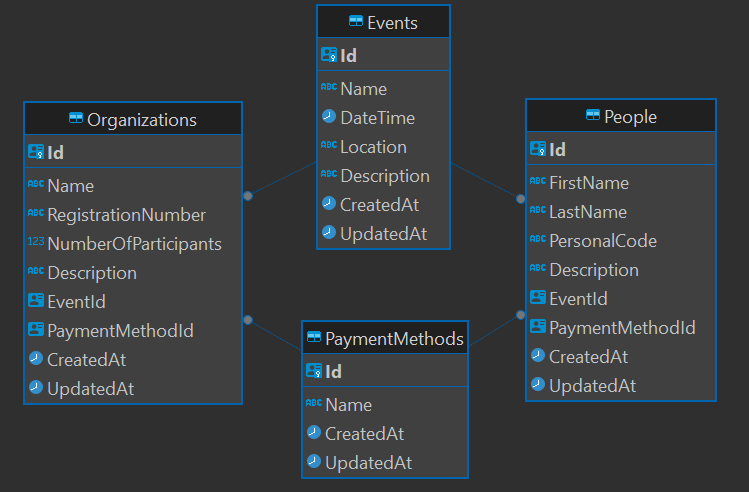

# event-management-system

This repository contains the source code for an Event Management Web Application developed using ASP.NET Core MVC and Entity Framework Core. The application allows users to organize and manage events seamlessly. Users can add new events, view participants, add attendees (both individuals and companies), and manage participant details.

